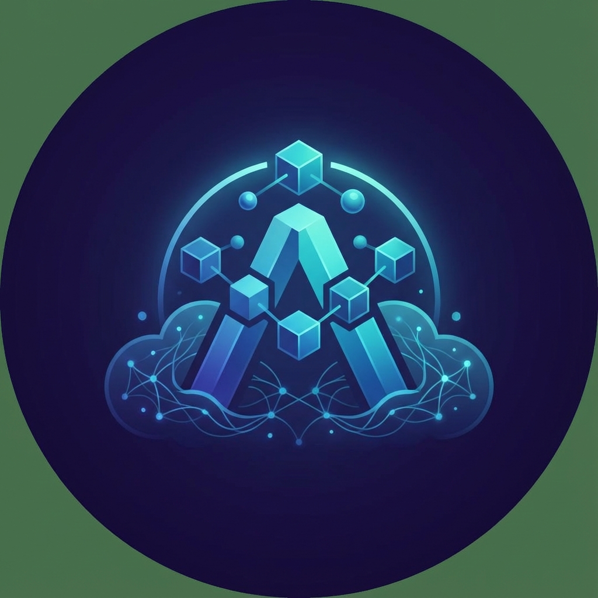

<p align="center">
  
</p>

<h1 align="center">Antigravity Manager</h1>

<p align="center">
  <strong>🚀 Gestor Profissional Multi-Contas para Google Gemini & Claude AI</strong>
</p>

<p align="center">
  Português (Brasil) | <a href="README.zh-CN.md">简体中文</a>
</p>

<p align="center">
  <a href="https://github.com/Draculabo/AntigravityManager/actions/workflows/testing.yaml">
    
  </a>
  <a href="https://github.com/Draculabo/AntigravityManager/actions/workflows/lint.yaml">
    
  </a>
  <a href="https://github.com/Draculabo/AntigravityManager/releases">
    
  </a>
  <a href="https://github.com/Draculabo/AntigravityManager/releases">
    
  </a>
  <a href="https://github.com/Draculabo/AntigravityManager/blob/main/LICENSE">
    
  </a>
</p>

---

## 🔬 Visão Geral Técnica

O **Antigravity Manager** é uma solução de engenharia avançada destinada a orquestrar recursos de Inteligência Artificial distribuídos. Projetado para superar as limitações de cotas e gerenciamento de sessões do Antigravity IDE, ele atua como uma camada de abstração entre o cliente (IDE/CLI) e os provedores de nuvem (Google/Anthropic).

Baseado em uma arquitetura robusta **Electron + NestJS**, o sistema implementa um proxy reverso determinístico que automatiza a substituição de tokens e o balanceamento de carga entre múltiplos pools de contas.

### 🧩 Arquitetura de Sistemas

O projeto utiliza uma separação rigorosa de interesses:

1.  **Core (Electron Main):** Gerencia o ciclo de vida da aplicação, segurança de credenciais e comunicação de baixo nível com o sistema operacional (incluindo suporte especializado para **WSL** e macOS Translocation).
2.  **Server Layer (NestJS):** Um servidor backend interno rodando dentro do processo Electron, responsável por expor uma API compatível com OpenAI/Anthropic. Utiliza **oRPC** para garantir tipagem estática entre o main process e a interface.
3.  **UI Layer (React 19):** Interface declarativa construída com **Tailwind CSS 4** e **Shadcn UI**, otimizada para monitoramento em tempo real via **TanStack Query**.

---

## 🔥 Funcionalidades Principais

*   ✅ **Pool Hierárquico de Contas:** Gerenciamento ilimitado de contas Google Gemini (OAuth2) e integração nativa com o estado do Antigravity IDE.
*   ✅ **Algoritmo de Troca Inteligente:** Monitoramento heurístico de cotas que realiza o chaveamento automático (< 5% de cota ou Rate Limit 429) em menos de 5 segundos.
*   ✅ **Proxy de API Local Transparente:** Servidor compatível com protocolos OpenAI e Anthropic, permitindo o uso de ferramentas como `Claude Code`, `Cursor` e `Wave` com o pool de contas do Manager.
*   ✅ **Segurança de Nível Bancário:** Criptografia de segredos via **AES-256-GCM** integrada ao Gerenciador de Credenciais nativo do SO (Keychain/Windows Credential Manager).
*   ✅ **Compatibilidade Cross-Platform PhD:** Suporte profundo a Windows (nativo e WSL), macOS (Intel/Silicon) e Linux.

---

## 🛠️ Stack Tecnológica

| Camada | Tecnologias |
| :--- | :--- |
| **Núcleo** | Electron, React 19.2, TypeScript 5.9 |
| **Backend Interno** | NestJS, oRPC, Zod |
| **Persistência** | Better-SQLite3 |
| **Estilização** | Tailwind CSS 4, Radix UI Primitives |
| **Estado & Rotas** | TanStack Query v5, TanStack Router |
| **Segurança** | Keytar (OS Integration), AES-256-GCM |
| **Qualidade** | Vitest (Unit), Playwright (E2E) |

---

## 🚀 Guia de Início Rápido

### Instalação

Baixe a versão mais recente para sua plataforma na página de [Releases](https://github.com/Draculabo/AntigravityManager/releases).

### Configuração de Desenvolvedor (Build)

1.  **Clone o Repositório:**
    ```bash
    git clone https://github.com/ilyra-ai/Antigravity_Manager.git
    cd Antigravity_Manager
    ```

2.  **Instale as Dependências:**
    ```bash
    npm install
    ```

3.  **Inicie em Modo Desenvolvimento:**
    ```bash
    npm start
    ```

4.  **Compilação de Produção:**
    ```bash
    npm run make
    ```

---

## 📝 Scripts Disponíveis

*   `npm start`: Inicia o ambiente de desenvolvimento via Electron Forge.
*   `npm run test:unit`: Executa a suite de testes Vitest (essencial para validar caminhos de IO).
*   `npm run test:e2e`: Validação de fluxos de usuário via Playwright.
*   `npm run lint`: Verificação estática de integridade de código (ESLint 9+).

---

## 📂 Estrutura do Projeto

```plaintext
src/
├── main.ts              # Ponto de entrada do Processo Principal (Electron)
├── preload.ts           # Ponte de segurança entre Main e Renderer
├── server/              # Backend operacional (NestJS / Proxy de API)
├── ipc/                 # Handlers de comunicação inter-processo
├── services/            # Lógica de negócio (Quota, Token, Processos)
├── renderer/            # Camada de Apresentação (React)
└── utils/               # Utilitários determinísticos (Caminhos, Logger, Criptografia)
```

---

## ❓ FAQ & Solução de Problemas

<details>
<summary><b>O aplicativo não detecta o Antigravity IDE no WSL?</b></summary>
A partir da versão v0.3.4, implementamos detecção nativa via <code>tasklist.exe</code>. Certifique-se de que os caminhos do Windows estão acessíveis via <code>/mnt/c/</code>.
</details>

<details>
<summary><b>Erro de permissão no Keychain (macOS)?</b></summary>
Isso ocorre devido à Translocação do macOS em builds não assinadas. Mova o app para a pasta <code>/Applications</code> e execute os comandos de sinalização descritos no manual completo de segurança.
</details>

---

## 🤝 Contribuição

Contribuições de alto nível são bem-vindas. Siga o protocolo de **Commits Semânticos** e garanta que todos os testes passem antes de abrir um PR.

---

## 📄 Licença

Distribuído sob a licença [CC BY-NC-SA 4.0](LICENSE). Para uso comercial, entre em contato com os mantenedores.

---

<p align="center">
  Desenvolvido com rigor técnico para a comunidade de IA. ⭐ Dê um Star se este projeto for útil!
</p>
